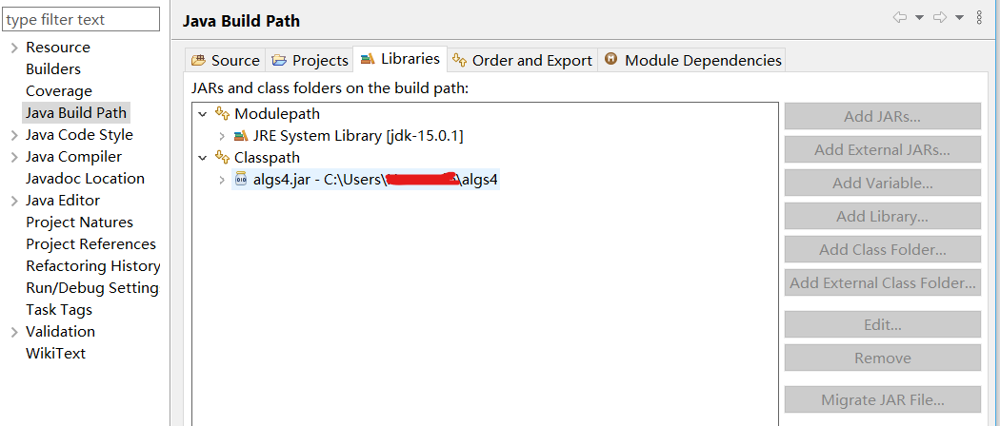

# Algorithms-4th
算法（第四版）的代码实践，原书采用Java进行讲授

## 相关环境配置
### IDE
我使用的IDE为Eclipse，JDK为15.0.1，具体的下载安装方式是参考了[廖老师的Java教程](https://www.liaoxuefeng.com/wiki/1252599548343744/1280507291631649)

### 标准库
《Algorithms》这本书中的代码是用他们自己编写的标准库，而不是Java自带的标准库，所以诸如`StdIn`等类都是不能直接用的（这些在自带库中都是`System.In`的形式，而且看起来里面的方法也不同）
#### 下载
可以在[官方教程](https://algs4.cs.princeton.edu/home/)中找到[下载地址](https://algs4.cs.princeton.edu/code/)，在这个页面还会有教你如何配置的
下载的文件倒也不是想象中的`std.jar`这样的形式，这是因为这个名字应该是和Java自带的标准库重名了，使用时也调用不了，所以正确的下载文件是[algs4.jar](https://algs4.cs.princeton.edu/code/algs4.jar)
#### 配置
配置主要是要把`algs4.jar`加入到计算机的用户变量里面去（我的电脑是win10）
高级系统设置->环境变量->用户变量->新建CLASSPATH->把`algs4.jar`的地址粘进去（官网写的放置位置为C:\Users\username\algs4\algs4.jar）
#### IDE中的配置
在Eclipse中，右键你的Java项目->properties->Java Buile Path->上方的Libraries->右边Add External JARs->选择`algs4.jar`的地址即可
> 不过我的是点了Classpath后`Add External JARs`键才亮的，所以就添加在这个下面了

#### 具体引用方式
```java
import edu.princeton.cs.algs4.*;
```

#### 参考博客

[算法 第四版 在Eclipse中调用Algs4库](https://blog.csdn.net/xfyangle/article/details/81265246)

[IntelliJ IDEA搭建算法第四版的环境（导入algs4.jar）](https://blog.csdn.net/qq_43152052/article/details/100155374)